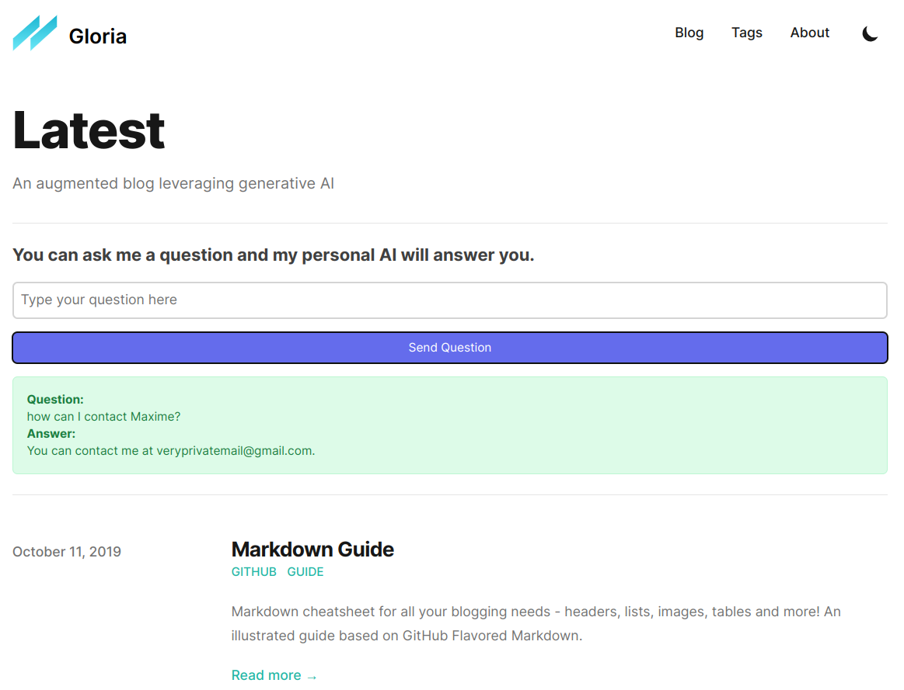

# Gloria: your personal blog augmented with Generative AI

Gloria will help you create a free interactive blog powered by AI.
It will have a growing set of tool to help you manipulate information and create engaging blog post with the help of AI.

The first tool is a personal assistant that will help you answer questions from your readers.
You can see a demo at https://maximeai.com

The stack is Nextjs and Langchain. It is hosted on Vercel and Supabase for the database. It has been optimized to work on free tiers.

Here is a screenshot of the homepage:



All contributions are welcome.

## Installation

Install the packages: `npm install`

### Create the table that will store the documents

Run this SQL query in your postgresql database to create the table that will store the documents.
⚠️ Your postgresql database must have the [pgvector extension](https://github.com/pgvector/pgvector) installed.
It is installed on your Supabase instances.
You can also use the provided docker-compose example that use the [official docker image](https://hub.docker.com/r/ankane/pgvector).

```sql
CREATE EXTENSION IF NOT EXISTS vector;

create table documents (
id text NOT NULL primary key,
"pageContent" text, -- corresponds to Document.pageContent
"sourceType" text, -- corresponds to the type of the source
"sourceName" text,
hash text, -- corresponds to Document.hash
metadata jsonb, -- corresponds to Document.metadata
embedding vector(1536) -- 1536 works for OpenAI embeddings, change if needed
);

create table users (
 id text not null,
 name text null,
 email text null,
 created_at timestamp without time zone not null default current_timestamp,
 updated_at timestamp without time zone not null,
 constraint users_pkey primary key (id)
);

create unique index users_email_key on users using btree (email) tablespace pg_default;

create table question (
    id text not null,
    content text null,
    answer text null,
    "successFromLLM" boolean not null default false,
    created_at timestamp without time zone not null default current_timestamp,
    published boolean not null default false,
    "authorId" text null,
    constraint Question_pkey primary key (id),
    constraint Question_authorId_fkey foreign key ("authorId") references users (id) on update cascade on delete set null
);
```

### Update the environment variables

Copy the `.env.local.example` file to `.env.local` and update the variables with your own values.

## Customize the personal assistant

### Change the prompt

Modify the `gloria.config.ts file to make the personal assistant answer the question as you want.

### Create the private data needed for the personal assistant to answer the questions

Fill the `knowledge-base` folder with text files that contains your personal information.

You can also use any LangChain's [documents loader](https://js.langchain.com/docs/modules/indexes/document_loaders/examples/file_loaders/) to create the knowledge base.

All your articles in the data folder will also be used to create the knowledge base.

Whenever you want to make new information available you can just run the `npm run update:kb` command.
This command will populate the table documents in your database with the new information.

## Run the development server

Run `npm run dev` to start the development server.

## Deploy on Vercel

You can deploy this project on Vercel. You will need to set the environment variables in the Vercel dashboard.

## Credits

It was started from the [Tailwind Nextjs Starter Blog](https://github.com/timlrx/tailwind-nextjs-starter-blog).
I have left the original README [here](docs/nextjs-starter-README.md).
I changed a bit the code like not using the analytics and the comments.
